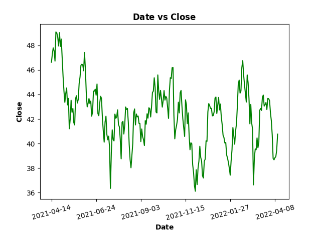
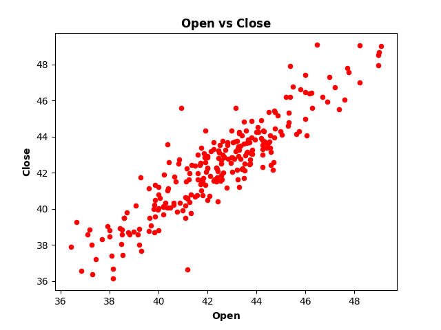
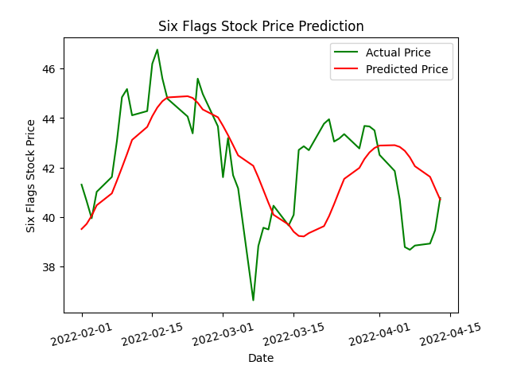

# The-Stock-Stalker
Machine Learning Program to predict the future price of a stock using past data.

The models were tested using the data for [Six Flags Stock Prices.](./Six%20Flags%20Stock.csv)

## Results
### [Linear Regression Analysis](./LinearRegression.py)

 (Notice the linearity of the data in this plot)

### [LSTM Model Prediction](./LSTM.py)

### *Optional Note:
The LSTM model uses the machine learning library tensorflow which is optimized
to run on the GPU. If you want to run this program on your local device, then
follow these instructions to get tensorflow working properly.

- Linux / macOS:
https://www.tensorflow.org/install/source
- Windows:
https://www.tensorflow.org/install/source_windows
